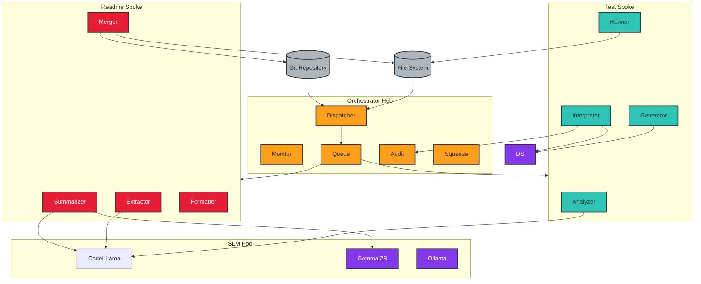
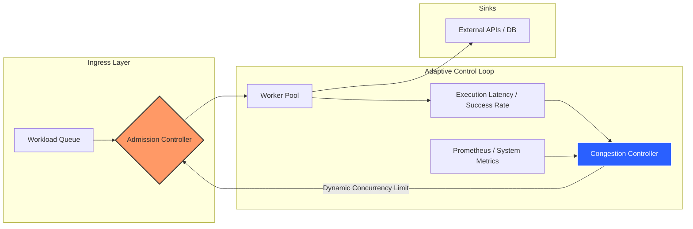

# 🚀 Andres Arias | SWE · Cloud Infrastructure · DevOps
### Senior Full-Stack Software Engineer & Cloud-Native Architect

I architect **resilient, observable systems** where every transaction is traceable, every failure is recoverable, and infrastructure is treated as code—including documentation.

My approach treats **Documentation as Infrastructure**: standards live in version control and evolve through pull requests, not PDFs.

---

## 🛠 Technical Specialization

| Domain | Core Competencies |
|--------|-------------------|
| **Architecture** | Event-driven systems · Apache Kafka · Cloud-native design patterns · Asynchronous workflows |
| **Infrastructure** | GCP · AWS · Terraform (HashiCorp Certified) · Zero-Trust networking · Hub-and-Spoke topology |
| **Backend & Performance** | Go · Python (Django/FastAPI/Flask) · Node.js · Adaptive concurrency control |
| **DevSecOps** | Security-first CI/CD · Checkov · Automated SOC2 governance · Compliance-as-Code |

---
## 🚀 Currently Working On

### **[spoke-tool](https://github.com/Drecoder/spoke-tool)**

I am developing a local AI orchestration engine designed to automate the **Documentation as Infrastructure** lifecycle. It utilizes a Hub-and-Spoke architecture to ingest multi-language source code (Go, Python, Node.js) and generate high-fidelity unit tests and technical READMEs using local SLMs (Small Language Models).

#### **System Architecture**

The tool operates as a sovereign dispatcher, routing code through specialized spokes (Test & Readme) and an SLM pool (CodeBERT, Gemma, DeepSeek) to produce verified, audited output without data leakage.

---

### **[Adaptive Concurrency Orchestrator](https://github.com/Drecoder/Adaptive-Concurrency-Orchestrator)**

I am architecting a high-throughput system to mitigate the "Thundering Herd" problem and resource exhaustion in distributed environments. This project implements a **Closed-Loop Control System** (relying on TCP-style congestion control) to throttle workloads based on real-time telemetry dynamically.

#### **System Architecture**

The orchestrator treats concurrency as a dynamic variable, adjusting the admission gate based on a continuous feedback loop of system health and execution latency.

---

## 🧠 Engineering Philosophy

**Flow Management**  
Every action, workflow, and process must be observed, traceable, and recoverable. If it isn't instrumented, it doesn't exist.

**Operational Continuity**  
Service reliability is a signal-driven discipline. I implement Red/Green logic and progressive delivery to maintain system integrity during change.

**Sovereignty-as-Code**  
Networking foundations should automate compliance. I build modular, secure topologies that maintain security posture without manual intervention.

**Mnemonic Mastery**  
I apply memory athlete techniques such as "chunking, memory palaces, and spatial recall" to rapidly internalize complex algorithms and system architectures.

---

## 📂 Featured Systems

### [sovereign-vpc](https://github.com/Drecoder/sovereign-vpc)
WIP — A Google Cloud Platform (GCP) networking foundation built with HCL (Terraform) that implements Zero-Trust principles and Sovereignty-as-Code. It features a modular VPC architecture with Hub-and-Spoke peering and automated compliance controls.  
`HCL` · `Terraform` · `GCP` · `Zero-Trust`

### [data-net-vpc](https://github.com/Drecoder/data-net-vpc)
An observability-focused networking project demonstrating advanced VPC architecture in GCP. It integrates automated CI/CD pipelines with Checkov security scans to maintain a security-first posture.  
`HCL` · `Terraform` · `GCP` · `Checkov` · `CI/CD`

### [Adaptive-Concurrency-Orchestrator](https://github.com/Drecoder/Adaptive-Concurrency-Orchestrator)
A Node.js-based Proof of Work (PoW) for an adaptive concurrency controller that functions as an infrastructure shield for Headless WordPress & Next.js stacks. It utilizes Gradient-Based Orchestration for intelligent traffic management.  
`Node.js` · `Redis` · `Nginx` · `JavaScript`

### [HOTEL](https://github.com/Drecoder/HOTEL)
An event-driven Hotel Operations (HotelOps) platform utilizing a NestJS + GraphQL backend and a React (Vite) frontend. It features a scalable microservices-ready architecture, using Kafka for message brokering and event streaming.  
`NestJS` · `GraphQL` · `React` · `Kafka` · `TypeScript`

### [cyber](https://github.com/Drecoder/cyber)
A multi-service full-stack demonstration showcasing a Go backend and React frontend integrated with a robust observability stack. It features Prometheus, Grafana, and OpenTelemetry for advanced metrics collection and distributed tracing.  
`Go` · `React` · `OpenTelemetry` · `Prometheus` · `Grafana`

### [Engineering_Excellence_Playbook](https://github.com/Drecoder/Engineering_Excellence_Playbook)
A comprehensive Consultant-First Engineering Playbook and operational framework. It codifies repeatable standards for Frontend, Backend, and Infrastructure with a focus on Async Flows, Observability, and Platform Governance.  
`Markdown` · `ADRs` · `GitHub Actions` · `Documentation`

---

## ⚖️ Strategic Competitive Edge
I value Observability-First design: I see the pattern where code is only "production-ready" once it provides clear signals. By integrating OpenTelemetry and Prometheus metrics, I ensure systems are observable and traceable from day one.

I understand the patterns of Cloud Sovereignty: I see the cloud as more than just hosting; it is a foundation for trust. I move beyond basic VPCs to implement Sovereignty-as-Code and Hub-and-Spoke models that protect sensitive data environments.

I understand the trade-offs of Velocity vs. Risk: I recognize that speed should not compromise safety. I bridge this gap by developing specialized Go-based governance auditors that automate SOC2 evidence generation, allowing teams to maintain momentum without losing compliance.

---
